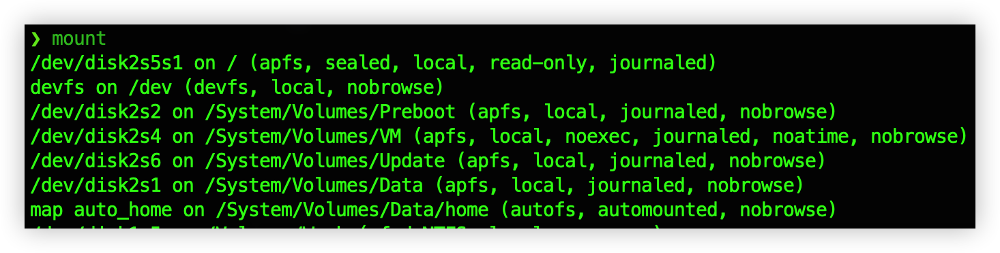
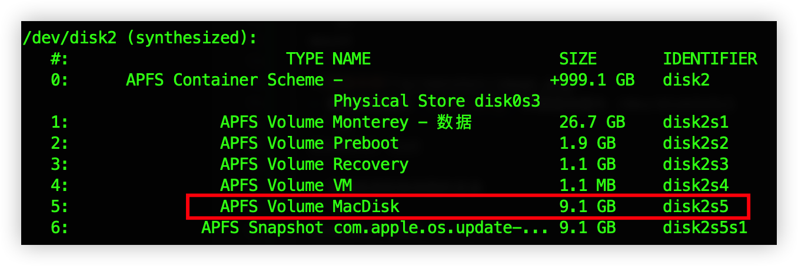

# i7-13700K-ASUS-PRIME-Z790-P-WIFI-D5-HACKINTOSH

## 概览
| 名称     | 型号                                                                | 说明                 |
| -------- | ------------------------------------------------------------------- | -------------------- |
| 电脑型号 | 华硕 台式电脑                                                       |                      |
| 操作系统 | Windows 10 专业版 精简版 64位（Version 22H2 / DirectX 12）          |                      |
| 处理器   | 13th Gen Intel Core i7-13700K                                       | 已驱动               |
| 主板     | 华硕 PRIME Z790-P WIFI（LPC Controller/eSPI Controller Z790芯片组） | 已驱动               |
| 显卡     | AMD Radeon RX 580 Series ( 8 GB / 蓝宝石 )                          | (已驱动)需要刷成 570 |
| 显卡     | 英特尔 UHD Graphics 770                                             | 禁用                 |
| 内存     | 32 GB ( 金百达 DDR5 6800MHz 16GB x 2 )                              | 已驱动               |
| 主硬盘   | 三星 MZVL21T0HCLR-00B00 (1024 GB / 固态硬盘)                        | 已驱动               |
| 次硬盘   | 西数 WD_BLACK SN770 1TB (固态硬盘)                                  | 已驱动               |
| 显示器   | 三星 SAM0273 SyncMaster ( 19.1 英寸  )                              | 已驱动               |
| 网卡     | Intel(R) Wi-Fi 6 AX201 160MHz                                       | 已驱动               |
| 网卡     | Realtek Gaming 2.5GbE Family Controller                             | 已驱动               |
| 声卡     | AMD HD Audio Controller                                             | 已驱动               |
| 声卡     | 瑞昱  @ 英特尔 High Definition Audio 控制器                         | 已驱动               |

## 操作系统支持
| 名称              | 版本 | 验证   |
| ----------------- | ---- | ------ |
| macOS Ventura     | 13.* | 已验证 |
| macOS Monterey    | 12.* | 已验证 |
| macOS Big Sur     | 11.* | 未验证 |
| macOS Catalina    | 10.* | 未验证 |
| macOS Mojave      | 10.* | 未验证 |
| macOS High Sierra | 10.* | 未验证 |

## 己驱动
- 独显
- 声卡
- USB（Type-C）
- 有线网卡
- 蓝牙
- 变频
- WIFI
- 多显示器
- 隔空投送
- 接力
- 睡眠

## SIP 关闭 / 开启
- macos 启动时按住 cmd+R 键，进入Recovery模式
- 打开终端，输入：
  ```sh
  # 关闭 SIP
  csrutil disable
  csrutil authenticated-root disable
  # 开启 SIP
  csrutil enable
  csrutil authenticated-root enable
  # 查看 SIP 状态
  csrutil status
  csrutil authenticated-root status
  ```
## 执行可写目录挂载 / 创建镜像
  - 查看磁盘挂载信息
  ```sh
  mount
  ```
  
  - 可以看到我这里挂载的 `/dev/disk2s5s1` 快照为 `read-only`

  - 查看磁盘信息
  ```sh
  diskutil list
  ```
  
  - 红色标注的 `/dev/disk2s5` 是我的 `本地磁盘`
  - 将 `本地磁盘` 挂载到个人用户目录下
  ```sh
  mkdir /Users/用户名/mnt
  sudo mount -o nobrowse -t apfs /dev/disk2s5 /Users/用户名/mnt
  ```

## 开启 HiDPI
- 获取显示器信息
```sh
ioreg -l | grep "DisplayVendorID"
ioreg -l | grep "DisplayProductID"
```
1. 将`=`号后面的`10进制数` 转换为 `16进制数`
   - 假设 DisplayVendorID 的 16进制数 = AAA
   - 假设 DisplayProductID 的 16进制数 = BBB
2. 创建目录
   - `/Users/用户名/DisplayVendorID-AAA`
3. 创建文件
   - `/Users/用户名/DisplayVendorID-AAA/DisplayProductID-BBB`
4. 前往 [在线显示器配置页](https://comsysto.github.io/Display-Override-PropertyList-File-Parser-and-Generator-with-HiDPI-Support-For-Scaled-Resolutions/)
5. 将上述两个`16进制值`分别及`显示器名称`填入表单
6. 将生成的`xml内容`写入`/Users/用户名/DisplayVendorID-AAA/DisplayProductID-BBB`
7. 打开终端执行命令
   ```sh
   sudo defaults write /Library/Preferences/com.apple.windowserver.plist DisplayResolutionEnabled -bool true
   # 复制 显示器配置信息 到 挂截的本地磁盘 相应目录
   cp -r /Users/用户名/DisplayVendorID-AAA /Users/用户名/mnt/System/Library/Displays/Contents/Resources/Overrides/
   ```
8. [下载RDM](https://github.com/usr-sse2/RDM/releases) 并安装
9. 重启macos后，打开 RDM.app，切换分辨率

## 注
 - 只有将 `本地磁盘` 挂载到 有`写入权限`的目录，才能对其进行写入操作
 - 本例中，我们将 DisplayVendorID-AAA 复制到 `/Users/用户名/mnt/System/....`
   实际是复制到了 `/System/...`
